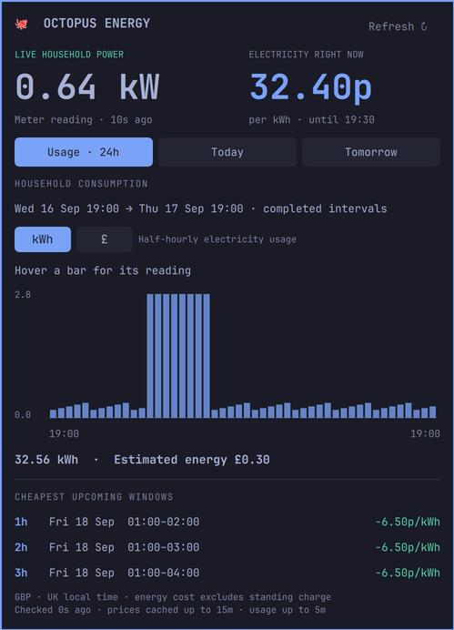
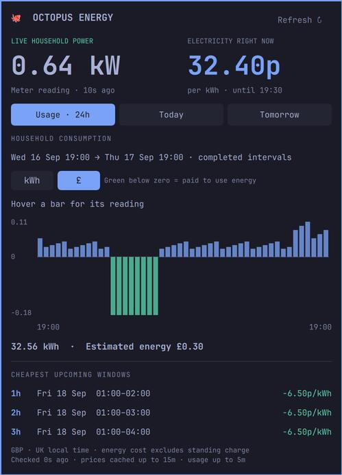
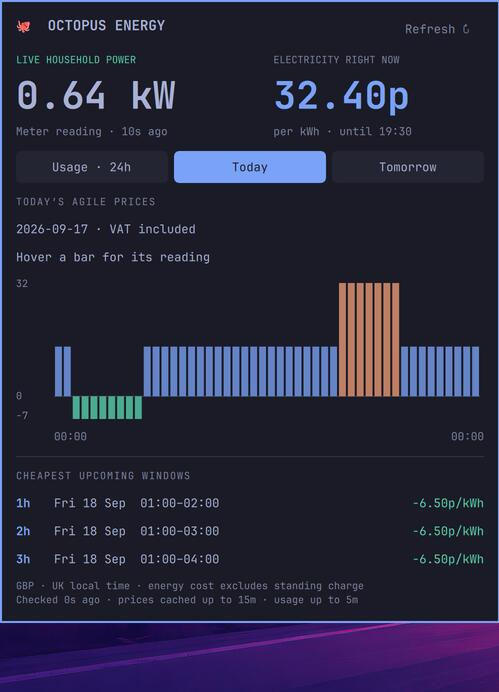

# Octopus Energy for Omarchy

An independent community bar plugin: Agile electricity prices, Home Mini live power,
24 completed hours of household usage, and cheapest upcoming 1/2/3-hour windows.
No OpenClaw, VPS, browser, Node.js, or Python package dependencies. Not affiliated
with Octopus Energy or Omarchy.

## Requirements

- Omarchy 4 with its Quickshell plugin runtime (`qs.Ui` / `qs.Commons`).
- Python 3.10+ with system timezone data.
- UK Octopus Agile tariff. An API key is optional for price-only use.
- Octopus Home Mini telemetry access for live power. A standard-meter history
  fallback exists but has not yet been live-tested without a Home Mini.

Live-tested on Omarchy 4.0.4-1, Surface Pro 3, with a UK Agile account/Home Mini.
This is an early 0.1 community release. It is not yet listed in the Omarchy plugin catalogue.

## Screenshots

Actual Omarchy panel, rendered with **synthetic demo data**, not customer readings.





## Install

```sh
git clone https://github.com/brokemac79/omarchy-octopus.git
cd omarchy-octopus
```

### Install from a checkout

Run on the Omarchy desktop as your ordinary user:

```sh
mkdir -p ~/.config/omarchy/plugins/community.octopus-energy
cp manifest.json BarWidget.qml EnergyPanel.qml Chart.qml octopus.py \
  ~/.config/omarchy/plugins/community.octopus-energy/
python3 ~/.config/omarchy/plugins/community.octopus-energy/octopus.py --setup
omarchy plugin validate ~/.config/omarchy/plugins/community.octopus-energy
omarchy-shell shell rescanPlugins
omarchy plugin enable community.octopus-energy right
```

The setup command masks API-key input. Find your key in the Octopus developer
account page; never put it in a command argument or public repository. Product and
full tariff code must match your account/region. Empty API key enables prices only.
Alternatively, Omarchy supports Git-managed installation:

```sh
omarchy plugin add https://github.com/brokemac79/omarchy-octopus --enable
python3 ~/.config/omarchy/plugins/community.octopus-energy/octopus.py --setup
```

The manual-copy method was tested on the development machine; Git-managed install
uses the native Omarchy CLI. Both require a compatible plugin runtime.
See [troubleshooting and setup](docs/SETUP.md) for tariff codes and updates.

## Use

Click the octopus/price pill. Tabs select Usage, Today and Tomorrow; left/right
arrows switch tabs, Escape closes, and R refreshes. Hover chart bars for exact
interval values. Usage has a kWh / £ switch (C also toggles it). The £ graph
shows each interval’s kWh × its rate, with negative costs green below zero;
missing rates remain gaps, not zero. Negative prices are green; rates over 30p are warm-coloured
(the latter is a visual threshold, not a claim about your tariff average).

The bar shows VAT-inclusive p/kWh, not pounds. Live power is kW. Consumption is
kWh per interval. Energy-cost estimates sum interval kWh × VAT-inclusive rate;
standing charges are excluded. Incomplete usage or price coverage suppresses the
full cost estimate. Cheapest windows use only complete future half-hour intervals
and compare unweighted average rates; actual appliance cost depends on its load.

Usage covers the most recent 24 **completed** hours, excluding the still-changing
current half-hour. The range is labelled. Missing readings are not zero-filled.
Tomorrow can be partially published: the panel shows available/expected intervals.
Daylight-saving days have 46 or 50 intervals. Display labels use Europe/London
regardless of the desktop timezone. API interval timestamps retain their offsets.

## Refresh and failure behaviour

- Panel open: snapshot every 15 seconds; closed: every 60 seconds.
- Live telemetry cached 15 seconds; history 5 minutes; rates 15 minutes.
- Explicit Refresh/R can refresh caches after 30 seconds; failures back off 60s.
- No network activity continues when the shell/plugin is stopped.
- Home Mini readings older than 120 seconds are marked stale; the last value
  stays visible, never silently becoming zero. The current price disappears at
  its valid-to boundary if no successor is cached.
- Token renewal is automatic. Requests have a 12-second timeout, no auth-bearing
  redirects, fixed Octopus HTTPS host validation, and bounded pagination.
- Last good results survive connection failures with an error message. Cached
  data lives on the local machine; internet access is still needed for freshness.

## Files and privacy

All runtime state is outside the plugin source:

- `$XDG_CONFIG_HOME/omarchy-octopus/config.json`: product, tariff, timezone, Home Mini switch.
- `$XDG_CONFIG_HOME/omarchy-octopus/credentials.json`: API key/account/meter, mode 0600.
- `$XDG_CACHE_HOME/omarchy-octopus/`: private token and readings caches, 0600 files.

XDG roots default to `~/.config` and `~/.cache`. Credentials are never emitted
in JSON output, logs, UI, process arguments or source files. This uses private
local files rather than a desktop keyring; anyone who can read your user files
can read the key. No consumption/account data is sent anywhere except Octopus.
No exports or load-control actions are implemented. This is read-only monitoring.

For support, share version/errors, not credentials or full cache files.

## Disable / uninstall

```sh
omarchy plugin disable community.octopus-energy
omarchy plugin remove community.octopus-energy
```

Then optionally delete the two `omarchy-octopus` config/cache directories using
your desktop file manager. Disable/removal does not revoke the API key.

## Development and contribution

`octopus.py` is the independently testable data adapter; QML files own presentation.
Run `python3 -m unittest discover -s tests -v`. Tests use synthetic data, not live
customer fixtures. The real-account proof is separate and never committed.

The plugin uses existing Omarchy panel widgets and theme colours. No core Omarchy
files or gateway changes are needed. Before seeking a catalogue listing, test another installation,
price-only setup, a non-Home-Mini account, and shell-version compatibility; review
API usage expectations and replace any project metadata as appropriate.

The GraphQL query shape was cross-checked against the public
BottlecapDave/HomeAssistant-OctopusEnergy integration; this adapter is independent
stdlib code, not a vendored copy. Octopus may evolve its GraphQL schema.

## Licence and contributing

[MIT](LICENSE), copyright © 2026 brokemac79. You can use, modify and redistribute
this plugin, including commercially, provided the copyright and licence notice
are retained. No warranty is provided. Octopus Energy and Omarchy names belong
to their respective owners; no endorsement is implied.

See [CONTRIBUTING.md](CONTRIBUTING.md) and [SECURITY.md](SECURITY.md).

